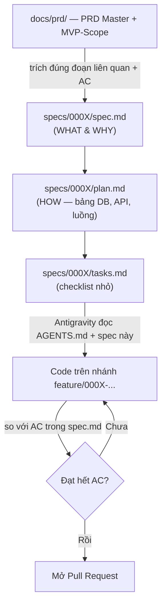
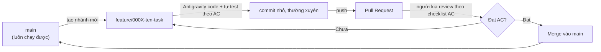

# CrewLab — Quy Trình Vibe Coding & Cộng Tác (v1)

**Đối tượng:** team 2 người, non-tech, dùng Google Antigravity làm công cụ code chính.
**Mục tiêu:** biến 2 file PRD (rất tốt nhưng rất dài) thành một quy trình code lặp lại được, không phụ thuộc vào việc "AI nhớ" hay "2 đứa nhớ".

---

## 0. Quyết định phải chốt trước tiên: build theo bản nào?

Repo hiện có 2 tài liệu:

| Tài liệu | Scope | Ước lượng thời gian (tự PRD ghi) |
|---|---|---|
| `PRD-Master-v3.2.md` | 12 agent, Hindsight, ChromaDB, Docling+Chonkie, Meta Graph API, Analytics G01-G04, IMC Planner | ~8-11 tháng (bản đầy đủ) |
| `CrewLab-MVP-Scope.md` (v3, "thay thế v2") | 5 agent (B02, B03, D01, D02, E01), Postgres thuần thay Hindsight/Chroma, không Meta API, không Analytics | ~3.5-4 tháng |

**Khuyến nghị:** Phase 1 build đúng theo `MVP-Scope`. `PRD-Master` là tài liệu kiến trúc/tầm nhìn dài hạn — dùng để tra cứu "sau này sẽ ra sao", **không** dùng để lấy task code ngay. Lý do: 2 người non-tech vibe code 12-agent-stack + Hindsight + Meta Graph API ngay từ đầu là rủi ro rất cao, kể cả với team kỹ thuật.

Hệ quả cụ thể cho AI: mọi lúc Antigravity thấy nhắc tới Hindsight, ChromaDB, F01 Meta Publisher, G01-G04 — nó phải dừng lại và hỏi lại người, không được tự động build theo bản đầy đủ. Điều này được ghi thẳng vào `AGENTS.md` (xem file đính kèm).

**Việc cần làm ngay:** `MVP-Scope.md` mục 7 có 2 câu hỏi mở chưa chốt (ngưỡng pass/fail của E01, và 4 default tính năng phụ). Ngoài ra bản thân `PRD-Master` (Tầng 4 §C3) cũng tự ghi chú có **lệch giữa ngưỡng E01 ở Tầng 2 (7.0) và Tầng 3 (8.0)** chưa thống nhất. Chốt xong 2 việc này *trước khi* viết spec cho E01 — nếu không Antigravity sẽ phải đoán, và 2 đứa sẽ đoán khác nhau.

---

## 1. Nguyên tắc tổng quát

1. **File là chân lý, chat là tạm thời.** Antigravity không giữ trí nhớ giữa các phiên làm việc — mỗi lần mở lại, agent bắt đầu từ đầu và chỉ đọc được những gì nằm trong file (Rules, docs, spec). Quyết định nào quan trọng mà chỉ nằm trong đoạn chat thì coi như chưa tồn tại.
2. **Đặc tả trước, code sau.** Với một dự án nhiều tầng như CrewLab, để Antigravity "tự bơi" từ 1 câu prompt mơ hồ sẽ ra kết quả khác nhau mỗi lần chạy, và khác nhau giữa 2 người. Mỗi tính năng nhỏ cần một file spec ngắn trước khi gõ "code đi".
3. **PRD đã có AC (Acceptance Criteria) rất chi tiết — tái sử dụng, đừng viết lại.** Đây là tài sản quý nhất tụi mày đang có: gần như mọi agent/feature trong PRD đều có bảng AC rõ ràng (AC-WF-xx, AC-T3-xx, AC-MEM-xx...). Copy đúng các AC liên quan vào spec của từng task, dùng làm tiêu chí "xong hay chưa" — đừng để Antigravity tự quyết định thế nào là "xong".
4. **1 task = 1 nhánh git = 1 phạm vi nhỏ, làm xong trong một buổi.** Task càng to, review càng khó, conflict càng dễ xảy ra giữa 2 người.

---

## 2. "Bộ não" chung — cấu trúc thư mục context

```
crewlab/
├── AGENTS.md                     ← Sổ tay hướng dẫn & quy tắc cho Antigravity (đọc tự động mỗi phiên)
├── docs/
│   ├── prd/
│   │   ├── PRD-Master-v3.2.md    ← giữ nguyên, ĐÓNG BĂNG, chỉ tham khảo tầm nhìn
│   │   └── MVP-Scope-v3.md       ← giữ nguyên, đây là target build thật của Phase 1
│   ├── decisions/                ← mỗi quyết định lớn = 1 file nhỏ (ADR - Architecture Decision Record)
│   │   ├── 0000-scope-quyet-dinh.md
│   │   └── 0001-nguong-pass-fail-e01.md
│   └── glossary.md               ← giải nghĩa FSM, HITL, RAG, Gate, Cycle... (vì cả 2 đứa non-tech)
├── specs/                        ← đặc tả TỪNG tính năng nhỏ, sinh từ MVP-Scope
│   ├── 0001-postgres-schema-mvp/
│   │   ├── spec.md               ← WHAT & WHY, copy từ PRD + AC liên quan
│   │   ├── plan.md               ← HOW, kiến trúc kỹ thuật cụ thể
│   │   └── tasks.md              ← checklist các việc nhỏ
│   └── 0002-content-item-fsm/...
├── backend/                      ← FastAPI + Celery
├── portal/                       ← Next.js Client Portal
├── internal-app/                 ← Next.js Internal App
└── .agents/skills/                ← SKILL.md nếu có quy trình lặp lại (vd "tạo agent contract mới")
```

**Vì sao tách PRD ra khỏi `specs/`?** PRD trả lời "tại sao / tầm nhìn dài hạn". `specs/` trả lời "tuần này làm chính xác cái gì". Nhét nguyên PRD Master (rất dài, 12 agent) vào mỗi task nhỏ sẽ khiến Antigravity lẫn lộn giữa "cái sẽ có sau này" và "cái cần code ngay" — chính là lỗi phổ biến nhất khi vibe code từ 1 PRD lớn.

**Về repo:** dù kiến trúc có 3 deployable unit tách biệt (Backend API, Client Portal, Internal App — theo đúng Tầng 4 §A0.1 của PRD), điều đó nói về *tách deploy pipeline*, không bắt buộc *tách git repo*. Với 2 người non-tech, khuyến nghị dùng **1 monorepo duy nhất** (như cây thư mục trên) — Vercel vẫn deploy được từ 1 subfolder (`portal/`, `internal-app/`) qua cấu hình "Root Directory", Coolify tương tự cho `backend/`. Ít repo hơn = ít chỗ để lạc mất context hơn.

---

## 3. Từ PRD khổng lồ → spec nhỏ Antigravity làm được

Áp dụng rút gọn luồng spec-driven development (specify → plan → tasks → implement) đang là chuẩn phổ biến nhất hiện nay cho AI coding — bản chất là ép agent ghi ra file ở mỗi bước thay vì giữ "trong đầu":



**Bước 1 — SPECIFY:** mở `specs/000X-ten-tinh-nang/spec.md`, dán đúng đoạn mô tả + bảng AC liên quan từ MVP-Scope (và từ PRD Master nếu cần thêm ngữ cảnh kỹ thuật, ví dụ contract của agent đó ở Tầng 3). Prompt Antigravity kiểu: *"Đọc AGENTS.md và specs/0001-.../spec.md. Nếu thiếu thông tin để làm plan, hỏi lại trước, đừng đoán."*

**Bước 2 — PLAN:** để Antigravity đề xuất kiến trúc kỹ thuật cụ thể (bảng nào, endpoint nào, luồng nào) trong `plan.md`. 2 đứa đọc ở mức khái niệm — không cần hiểu code, chỉ cần trả lời được câu "cái này có đúng ý mình không". Đây là bước rẻ nhất để bắt lỗi hiểu sai, vì sửa 1 đoạn plan.md rẻ hơn rất nhiều so với sửa code đã viết xong.

**Bước 3 — TASKS:** bẻ `plan.md` thành checklist nhỏ trong `tasks.md`, mỗi dòng nên xong trong ~1 buổi làm việc.

**Bước 4 — IMPLEMENT:** mỗi dòng trong tasks.md = 1 nhánh git riêng. Antigravity code xong tự chấm theo AC đã copy sẵn trong `spec.md` trước khi báo "xong".

---

## 4. Quy trình Git

### 4.1 Mô hình: GitHub Flow đơn giản hoá (không dùng GitFlow — quá rườm rà cho 2 người)

- Chỉ có **1 nhánh dài hạn**: `main` — luôn phải chạy được, không bao giờ push thẳng vào đây.
- Mỗi task từ `tasks.md` → 1 nhánh: `feature/000X-ten-task` (ví dụ `feature/0001-postgres-schema-mvp`).
- Xong → mở **Pull Request** → người còn lại review → merge → xoá nhánh.



### 4.2 Thao tác thực tế trong Antigravity (không cần thuộc lệnh git)

- Bật **GitHub MCP** trong Antigravity ngay từ Sprint 0 (Settings → MCP → GitHub) trên **cả 2 máy**. Từ đó có thể gõ thẳng "commit và push nhánh này", "tạo Pull Request", "assign issue #12 cho tao" bằng lời — Antigravity tự chạy git init/add/commit/push/tạo PR ở dưới, hiện log trong terminal panel để xem lại nếu cần.
- Vẫn có **Source Control panel** kiểu VS Code (icon nhánh cây ở sidebar trái) nếu muốn bấm nút thay vì gõ lệnh — nhìn trực quan diff trước khi commit.

### 4.3 Quy tắc tránh 2 người đụng nhau

Antigravity **chưa có tính năng làm việc thời gian thực chung 1 workspace** giữa 2 máy (không giống Google Docs) — nên git vẫn là cầu nối duy nhất giữa 2 người. Quy tắc:

1. **Trước khi mở Antigravity mỗi ngày → pull code mới nhất từ `main` trước tiên**, luôn luôn, kể cả khi "chắc chắn chưa ai đụng vào".
2. **Chia việc theo module, không chia theo dòng code.** Gợi ý: 1 người phụ trách Backend (Tầng 1-2: schema, FSM, agent logic), 1 người phụ trách Portal/Frontend (Tầng 4). Giảm khả năng 2 người cùng sửa 1 file.
3. Không ai giữ 1 nhánh feature mở quá 1-2 ngày — nhánh sống càng lâu, càng dễ conflict khi merge (đúng nguyên tắc chung của mọi git workflow hiện đại).

### 4.4 Bảo vệ nhánh `main`

Trên GitHub: Settings → Branches → Branch protection rule cho `main` → bật "Require a pull request before merging". Việc này chặn cả 2 người (kể cả lúc vội) khỏi lỡ tay push thẳng làm hỏng bản đang chạy tốt.

### 4.5 Quy ước commit message

Dùng Conventional Commits: `feat: ...`, `fix: ...`, `docs: ...`, `chore: ...`. Ghi rule này vào `AGENTS.md` để commit message do Antigravity tự sinh cũng theo đúng format — sau này nhìn lại lịch sử dễ hơn nhiều.

---

## 5. Quản lý task & tiến độ

- **GitHub Projects** (kanban miễn phí, có sẵn trong GitHub, không cần học tool mới): mỗi cột = trạng thái spec (`Chưa spec` → `Đang plan` → `Đang code` → `Review` → `Xong`). Mỗi issue = 1 thư mục trong `specs/`.
- Map issue theo đúng cấu trúc "Tầng / Agent" đã có sẵn trong PRD — ví dụ issue "C1 — Postgres schema (rút gọn)", "D01 — Caption Writer contract", để không phải nghĩ lại cấu trúc từ đầu.
- **Không cần thêm tool nào khác ở giai đoạn đầu.** Chỉ cân nhắc thêm khi quy trình cơ bản này đã chạy trơn tru (xem mục 7).

---

## 6. Vòng lặp làm việc đề xuất

**Hằng ngày (5-10 phút, có thể nhắn qua chat, không cần họp video):**
- Mỗi người báo: hôm qua xong task nào, hôm nay làm task nào, có bị block không.
- Ai đang free → `git pull` trước → nhận 1 task tiếp theo trong GitHub Projects.

**Khi bắt đầu 1 task mới:**
1. Pull `main` mới nhất.
2. Mở/viết `specs/000X/spec.md` (copy đoạn PRD + AC liên quan).
3. Nhờ Antigravity viết `plan.md` → đọc lướt, duyệt hoặc sửa.
4. Nhờ Antigravity bẻ thành `tasks.md`.
5. Tạo nhánh `feature/000X-...`, code từng task nhỏ, commit thường xuyên.
6. Antigravity tự chấm lại theo AC trong `spec.md`.
7. Mở PR, người kia review (không cần đọc từng dòng — chỉ cần: AC có đạt không, có test không, có phá vỡ phần đang chạy không).
8. Merge, xoá nhánh, đóng issue trên GitHub Projects.

**Hằng tuần:** nhìn lại `docs/decisions/` — có quyết định nào phát sinh trong tuần cần ghi lại thành ADR không (vd: "tuần này đổi ý, dùng X thay Y vì Z").

---

## 7. Bộ công cụ nên dùng (xếp theo mức độ ưu tiên)

### Bật ngay từ Sprint 0 — miễn phí, ít setup
| Tool | Vai trò |
|---|---|
| `AGENTS.md` | Bộ nhớ dài hạn và quy tắc cho Antigravity (được tự động nạp mỗi phiên) |
| GitHub MCP (trong Antigravity) | Git/GitHub bằng lời nói, không cần thuộc lệnh |
| GitHub Projects | Kanban theo dõi task, free, tích hợp sẵn Issues/PR |
| Branch protection cho `main` | Chặn lỡ tay push thẳng, free |

### Cân nhắc khi bắt đầu viết spec đầu tiên
- **Tinh thần GitHub Spec Kit** (`github/spec-kit`, MIT, miễn phí): không nhất thiết cài nguyên bộ CLI của họ, nhưng nên copy đúng ý tưởng cốt lõi — `constitution.md` (nguyên tắc bất di bất dịch của dự án, ví dụ "không tự ý build phần chỉ có trong PRD Master khi chưa hỏi"), rồi `spec → plan → tasks`. Mục 3 ở trên chính là bản rút gọn của luồng này, đủ dùng cho 2 người mà không cần thêm công cụ.

### Cân nhắc khi codebase đã lớn dần (sau vài tuần code, nhiều file)
- **codegraph** (`colbymchenry/codegraph`, MIT, npm — hỗ trợ chính thức Antigravity trong danh sách agent nó tích hợp): dựng một "bản đồ tri thức code" cục bộ, tự động đồng bộ mỗi khi file thay đổi, giúp Antigravity không phải quét lại toàn bộ file mỗi lần được hỏi — tiết kiệm token/thời gian đáng kể khi repo đã có vài chục file trở lên. Chạy hoàn toàn local, không gửi code ra ngoài, cài bằng `npx @colbymchenry/codegraph`. Không cần thiết ở tuần đầu (repo còn nhỏ, Antigravity đọc trực tiếp còn nhanh hơn).

### Nâng cao / optional — chỉ khi quy trình cơ bản đã chạy mượt
- **Task Master AI** hoặc **Archon MCP**: 2 công cụ phổ biến để tự parse PRD thành danh sách task chi tiết, và (với Archon) tạo ra một "bộ nhớ" MCP dùng chung mà cả 2 máy Antigravity cùng đọc/ghi được — giải quyết đúng vấn đề "2 Antigravity không tự đồng bộ context với nhau" mà quy trình git ở trên đang xử lý bằng tay. Đánh đổi: Archon cần tự host bằng Docker Compose (đòi hỏi kỹ thuật hơn AGENTS.md nhiều), nên để lại làm nâng cấp khi 2 đứa đã quen tay với quy trình cơ bản, không phải việc của Sprint 0.

### Ghi chú về chi phí
Antigravity hiện đã chuyển sang mô hình có gói credit/subscription (không còn hoàn toàn miễn phí không giới hạn như bản preview đầu). Nên theo dõi mức dùng ngay từ đầu, đặc biệt khi để Antigravity chạy nhiều vòng lặp tự sửa lỗi liên tục — việc này ảnh hưởng trực tiếp tốc độ 2 người có thể lặp quy trình ở mục 6.

---

## 8. Checklist Sprint 0 (làm trước khi code dòng đầu tiên)

- [ ] Chốt Open Question trong `MVP-Scope.md` mục 7 (ngưỡng pass/fail E01, 4 default tính năng phụ) — ghi thành `docs/decisions/0001-nguong-pass-fail-e01.md`
- [ ] Tạo repo GitHub (private), invite cả 2 người
- [ ] Add `AGENTS.md` vào root
- [ ] Copy 2 file PRD vào `docs/prd/`, giữ nguyên, không sửa trực tiếp
- [ ] Ghi quyết định scope vào `docs/decisions/0000-scope-quyet-dinh.md` ("Phase 1 build theo MVP-Scope v3, PRD Master chỉ tham khảo")
- [ ] Chia module: ai phụ trách Backend, ai phụ trách Portal/Internal App
- [ ] Bật GitHub MCP trong Antigravity trên **cả 2 máy**
- [ ] Bật branch protection cho `main`
- [ ] Setup GitHub Projects board
- [ ] Viết spec đầu tiên: khuyến nghị bắt đầu từ **C1 — Postgres schema rút gọn**, vì mọi agent khác đều phụ thuộc vào bảng `content_items`/FSM này

---

## 9. Bẫy thường gặp khi 2 người non-tech vibe code dự án lớn

- **Để Antigravity "tự bơi" không có spec** → 2 phiên làm việc (hoặc 2 người) cho ra kiến trúc khác nhau cho cùng 1 tính năng.
- **Nhét nguyên PRD Master vào mỗi task nhỏ** → Antigravity code lố sang phần của bản 12-agent (ví dụ tự thêm ChromaDB dù MVP không cần).
- **Không commit thường xuyên** → mất phần code đang chạy tốt khi Antigravity "sửa lụi" làm hỏng nó; luôn có 1 điểm quay lại sạch.
- **2 người sửa cùng lúc trên cùng 1 file/module** → conflict git khó gỡ với người chưa quen git; chia module rõ từ đầu để tránh.
- **Bỏ qua AC có sẵn trong PRD** → không có cách khách quan nào biết Antigravity code "xong" hay chưa, dễ tin nhầm là xong trong khi còn thiếu.
- **Không ghi ADR khi đổi ý** → 2 tuần sau không nhớ vì sao lúc trước chọn cách này chứ không phải cách kia, Antigravity ở phiên mới cũng không biết.

---

## Phụ lục A — Mẫu ADR (Architecture Decision Record)

Dùng cho mỗi quyết định quan trọng, đặt trong `docs/decisions/NNNN-ten-quyet-dinh.md`:

```markdown
# NNNN — Tên quyết định ngắn gọn

**Ngày:** yyyy-mm-dd
**Người quyết:** Trường / Thuận / cả hai

## Bối cảnh
Vấn đề gì đang cần quyết định, tại sao nó phát sinh.

## Quyết định
Chọn phương án nào, nói ngắn gọn 1-2 câu.

## Vì sao
Lý do chọn phương án này thay vì phương án khác đã cân nhắc.

## Ảnh hưởng
Việc này làm thay đổi gì trong specs/, agent nào, hoặc file AGENTS.md nào cần cập nhật theo.
```

## Phụ lục B — Checklist review Pull Request (không cần đọc từng dòng code)

```markdown
- [ ] Nhánh có tên đúng quy ước feature/000X-...
- [ ] PR có link tới đúng thư mục specs/000X/
- [ ] Tất cả AC liệt kê trong specs/000X/spec.md đã được đánh dấu đạt
- [ ] Antigravity có báo cáo đã tự test/chạy thử trước khi mở PR không
- [ ] Không có thay đổi nằm ngoài phạm vi spec (nếu có, hỏi lại trước khi merge)
- [ ] Không phá vỡ phần nào đang chạy tốt trước đó (hỏi Antigravity chạy lại các test liên quan)
```

---

## Phụ lục C — Cẩm nang Git toàn tập cho Non-Tech / Newbie

> **Dành riêng cho team CrewLab:** Bạn không cần phải nhớ thuộc lòng tất cả các lệnh! Hãy dùng phần này như một cuốn từ điển tra cứu khi cần, hoặc copy câu lệnh ra lệnh thẳng cho AI (Antigravity) làm hộ.

---

### C1. Từ điển Git siêu bình dân (Hiểu Git trong 2 phút)

Để dễ hình dung, hãy tưởng tượng Git giống như **Hệ thống Quản lý File + Cỗ máy thời gian**:

| Thuật ngữ Git | Giải thích bình dân | Ví dụ minh họa |
|---|---|---|
| **Repository (Repo)** | Thư mục dự án được gắn "Cỗ máy thời gian". | Thư mục `CrewLab` trên máy bạn. |
| **Local Repo** | Kho lưu trữ nằm trên máy tính cá nhân của bạn. | Code ở ổ `D:\CrewLab`. |
| **Remote Repo (`origin`)** | Kho lưu trữ nằm trên mây (GitHub). | Web `github.com/vuducthuan2103-lgtm/CrewLab`. |
| **Commit** | Một "Nút Save / Điểm checkpoint". Lưu lại toàn bộ trạng thái code tại một thời điểm kèm lời nhắn giải thích. | *"Lưu mốc: Đã xong giao diện đăng nhập"*. |
| **Branch (Nhánh)** | Một "Bản sao song song". Giúp bạn tha hồ sửa/thử nghiệm trên nhánh riêng mà không sợ làm hỏng nhánh chính đang chạy ngon. | Nhánh `main` (nhánh chính) vs Nhánh `feature/0001-login` (nhánh làm thử). |
| **Stage (`git add`)** | "Chọn các file bỏ vào giỏ chuẩn bị lưu checkpoint". | Chọn file `index.html` và `style.css` chuẩn bị commit. |
| **Push** | "Đẩy / Tải lên" các checkpoint từ máy bạn lên kho GitHub trên mây. | Đưa code mới làm xong lên GitHub để đồng đội thấy. |
| **Pull** | "Kéo / Tải về" code mới nhất từ GitHub về máy bạn. | Lấy code mà đồng đội mới đẩy lên về máy mình. |
| **Fetch** | "Kiểm tra xem trên mây có gì mới không" nhưng chưa tải dán đè vào code hiện tại. | Nhìn xem GitHub có thay đổi gì không trước khi pull. |
| **Merge** | "Gộp / Trộn" code từ nhánh tính năng (feature) vào nhánh chính (`main`). | Đưa tính năng đã làm xong vào bản chính của dự án. |
| **Conflict (Xung đột)** | Khi cả 2 người cùng sửa chung 1 dòng trong 1 file, Git không biết chọn bản nào nên nhờ bạn bấm nút chọn. | Bạn sửa dòng 10 thành "Đỏ", đồng đội sửa dòng 10 thành "Xanh". |

---

### C2. Bảng tra cứu nhanh lệnh Git (Cheatsheet)

#### 1. Nhóm kiểm tra & theo dõi (Xem trạng thái)
* `git status` — Kiểm tra xem có file nào mới sửa, mới tạo hoặc chưa lưu không. *(Lệnh dùng nhiều nhất!)*
* `git branch` — Xem bạn đang ở nhánh nào.
* `git log --oneline -n 5` — Xem lại 5 mốc commit gần nhất (lịch sử làm việc).
* `git diff` — Xem chi tiết dòng nào vừa bị sửa so với mốc lưu cũ.

#### 2. Nhóm làm việc hàng ngày (Daily Flow)
* `git pull origin main` — Kéo code mới nhất từ nhánh `main` trên GitHub về máy.
* `git add .` — Chọn TẤT CẢ các file vừa sửa để chuẩn bị lưu.
* `git commit -m "feat: mô tả ngắn gọn việc vừa làm"` — Tạo mốc lưu (checkpoint).
* `git push origin <tên-nhánh>` — Đẩy mốc lưu từ máy lên GitHub.

#### 3. Nhóm quản lý Nhánh (Branching)
* `git checkout -b feature/000X-ten-task` — Tạo nhánh mới VÀ chuyển sang nhánh đó luôn.
* `git checkout main` — Chuyển về lại nhánh chính `main`.
* `git branch -d feature/000X-ten-task` — Xóa nhánh sau khi đã gộp xong vào `main`.

#### 4. Nhóm cứu nguy & Khôi phục (Undo / Reset)
* `git restore .` — **Cứu nguy 1:** Hủy bỏ toàn bộ thay đổi chưa commit, đưa code về lại mốc lưu gần nhất.
* `git reset --hard origin/main` — **Cứu nguy 2:** Bỏ hết code lỗi ở máy local, ép máy bạn giống hệt 100% trên GitHub.
* `git stash` — **Lưu tạm:** Giấu tạm code đang làm dở đi để chuyển nhánh khác.
* `git stash pop` — Lấy lại code đang làm dở vừa giấu ra để làm tiếp.

---

### C3. 8 Tình huống thực tế & Hướng dẫn từng bước

#### 📍 Tình huống 1: Bắt đầu ngày làm việc mới (Sync code mới nhất)
* **Khi nào dùng:** Đầu mỗi buổi làm việc, trước khi gõ câu prompt nào cho AI.
* **Các bước:**
  1. Chuyển về nhánh `main`:
     ```bash
     git checkout main
     ```
  2. Kéo code mới nhất từ GitHub về:
     ```bash
     git pull origin main
     ```

---

#### 📍 Tình huống 2: Bắt đầu làm một task mới (Tạo nhánh riêng)
* **Quy tắc vàng:** Không bao giờ code thẳng trên `main`. Mỗi task = 1 nhánh.
* **Các bước:**
  1. Tạo nhánh mới từ `main`:
     ```bash
     git checkout -b feature/0001-postgres-schema
     ```
  2. Bắt đầu cho Antigravity code trên nhánh này.

---

#### 📍 Tình huống 3: AI code xong 1 tính năng — Lưu & Đẩy lên GitHub
* **Khi nào dùng:** Khi AI thông báo đã hoàn thành 1 task nhỏ trong `tasks.md`.
* **Các bước:**
  1. Kiểm tra các file đã sửa:
     ```bash
     git status
     ```
  2. Chọn tất cả file chuẩn bị lưu:
     ```bash
     git add .
     ```
  3. Tạo mốc commit (theo quy ước Conventional Commits):
     ```bash
     git commit -m "feat: bổ sung bảng agent_memory vào postgres schema"
     ```
  4. Đẩy lên GitHub:
     ```bash
     git push origin feature/0001-postgres-schema
     ```

---

#### 📍 Tình huống 4: AI sửa bậy / code bị hỏng — Muốn quay lại lúc chưa sửa
* **Khi nào dùng:** AI thử sửa lỗi nhưng làm hỏng thêm, bạn muốn "Cancel" hết các sửa đổi dở dang để làm lại từ mốc sạch.
* **Các bước:**
  * **Cách A (Chưa commit gì):** Xóa sạch mọi sửa đổi vừa tạo ra:
    ```bash
    git restore .
    ```
  * **Cách B (Đã lỡ commit lỗi trên máy):** Đưa code quay về hệt như trên GitHub:
    ```bash
    git fetch origin
    git reset --hard origin/main
    ```

---

#### 📍 Tình huống 5: Đang làm dở task A thì có việc gấp phải sang làm task B
* **Khi nào dùng:** Bạn đang code dở nhánh A, chưa muốn commit nhưng phải gấp rút chuyển sang nhánh B để sửa lỗi khẩn cấp.
* **Các bước:**
  1. Cất tạm code dở dang vào "ngăn kéo":
     ```bash
     git stash
     ```
  2. Chuyển sang nhánh khác làm việc thoải mái.
  3. Khi quay lại nhánh A, mở "ngăn kéo" lấy code ra làm tiếp:
     ```bash
     git stash pop
     ```

---

#### 📍 Tình huống 6: Gặp xung đột code (Merge Conflict) — Đừng hoảng sợ!
* **Dấu hiệu nhận biết:** Khi pull hoặc merge, Git hiển thị thông báo `CONFLICT (content): Merge conflict in <tên-file>`.
* **Trong file code sẽ xuất hiện các ký hiệu lạ:**
  ```text
  <<<<<<< HEAD (Code hiện tại của bạn)
  trang_thai = "dang_xu_ly"
  =======
  trang_thai = "pending"
  >>>>>>> origin/main (Code của đồng đội mới push lên)
  ```
* **Các bước xử lý (Cực dễ):**
  1. Mở file bị conflict ra (VS Code / Antigravity sẽ tô màu highlight sẵn 2 đoạn).
  2. Chọn 1 trong 3 nút hiển thị sẵn trên màn hình:
     - `Accept Current Change` (Giữ code của bạn).
     - `Accept Incoming Change` (Lấy code của đồng đội).
     - `Accept Both Changes` (Giữ cả hai).
  3. Lưu file lại, sau đó gõ 3 lệnh để hoàn tất:
     ```bash
     git add .
     git commit -m "fix: giai quyet conflict"
     git push
     ```

---

#### 📍 Tình huống 7: Muốn đưa code hoàn thành vào nhánh chính `main` (Pull Request)
* **Các bước:**
  1. Đẩy nhánh feature lên GitHub (`git push origin feature/000X-...`).
  2. Mở trình duyệt truy cập repo GitHub (`https://github.com/vuducthuan2103-lgtm/CrewLab`).
  3. Bạn sẽ thấy nút vàng **"Compare & pull request"** xuất hiện trên web -> Bấm vào đó.
  4. Ghi mô tả ngắn gọn và bấm **"Create pull request"**.
  5. Đồng đội kiểm tra theo **Phụ lục B**, nếu OK thì bấm **"Merge pull request"** -> **"Confirm merge"**.
  6. Xóa nhánh feature trên web sau khi đã merge xong.

---

#### 📍 Tình huống 8: Nhờ AI Antigravity làm Git hộ (Mẹo cho Non-tech)
Vì bạn dùng Antigravity (Google DeepMind Agentic AI), bạn **không nhất thiết phải gõ từng lệnh Git thủ công**. Bạn có thể ra lệnh trực tiếp bằng tiếng Việt tự nhiên:

* 🗣️ *"Antigravity ơi, kiểm tra xem code có thay đổi gì chưa commit không?"* -> AI sẽ tự chạy `git status`.
* 🗣️ *"Tạo cho tao nhánh mới tên là feature/0002-content-pillar từ main."* -> AI tự chạy `git checkout main`, `git pull`, `git checkout -b...`.
* 🗣️ *"Commit toàn bộ thay đổi này với tin nhắn 'feat: hoàn thiện spec 0002' rồi push lên GitHub nhé."* -> AI tự chạy `git add`, `git commit`, `git push`.
* 🗣️ *"Hủy hết mấy thay đổi dở dang vừa làm đi, đưa code về mốc lưu cũ."* -> AI tự chạy `git restore .`.

> [!TIP]
> **Quy tắc an toàn khi nhờ AI dùng Git:**
> Trước khi để AI chạy lệnh `commit` hoặc `push`, luôn bảo AI: *"Cho tao xem danh sách file sắp commit (`git status`) trước nhé!"* để tránh lỡ tay push nhầm file rác hoặc thông tin bảo mật (file `.env`, passwords, v.v.).

