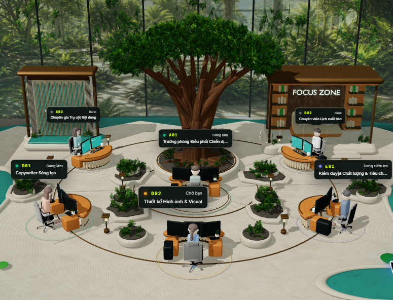
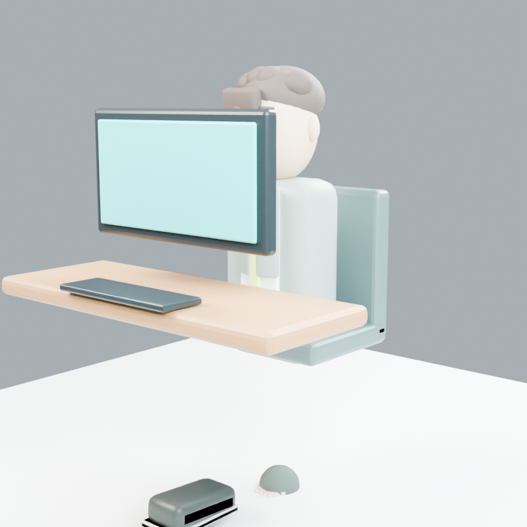
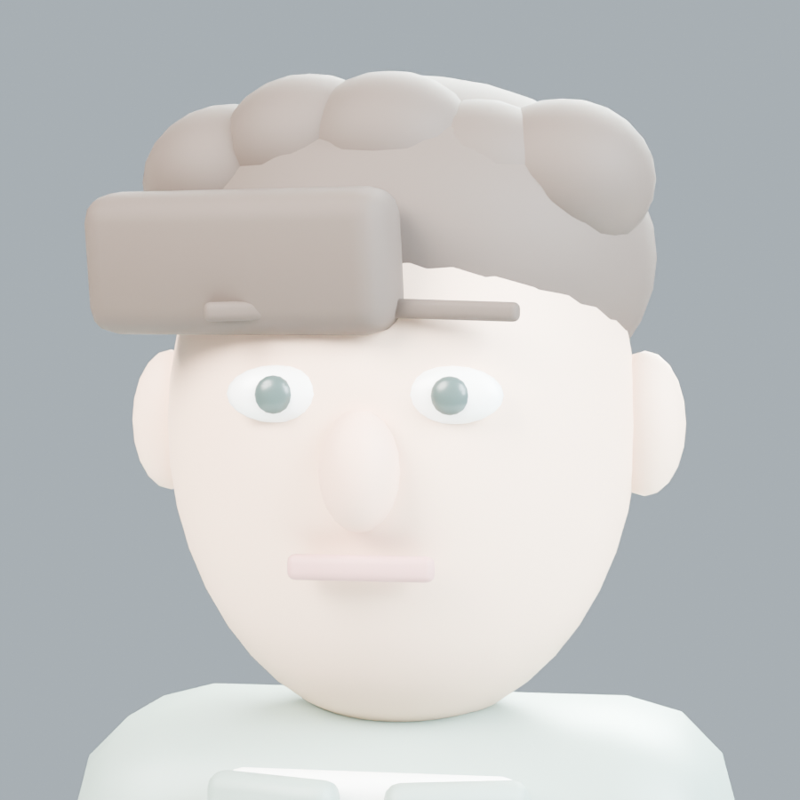
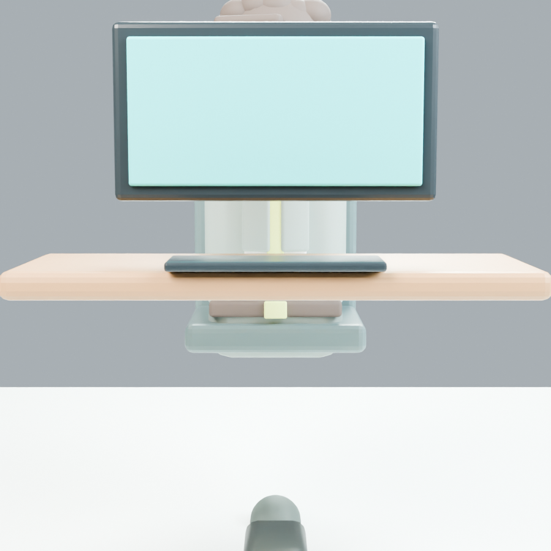
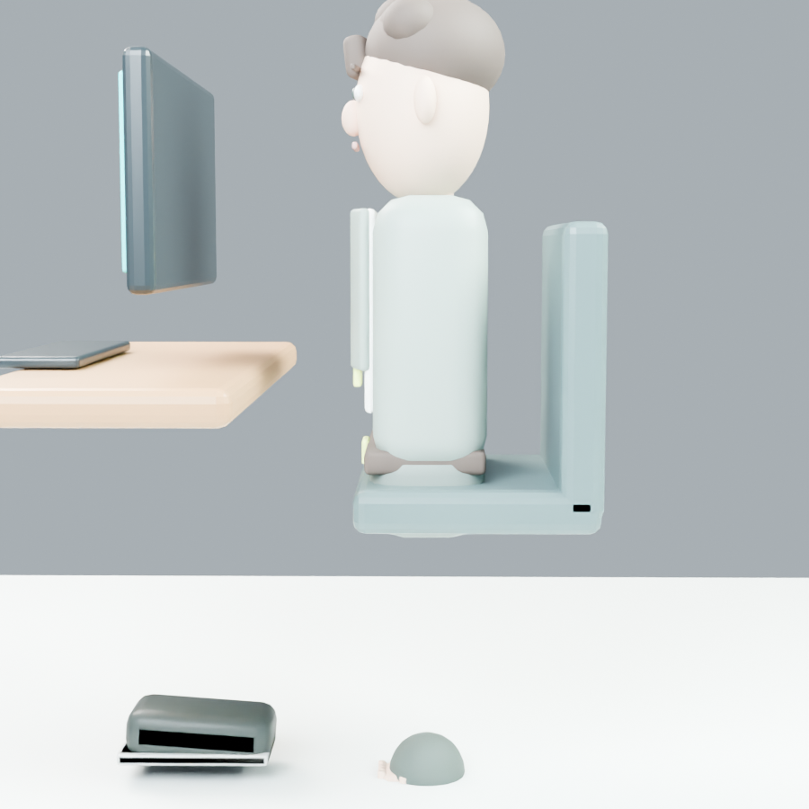
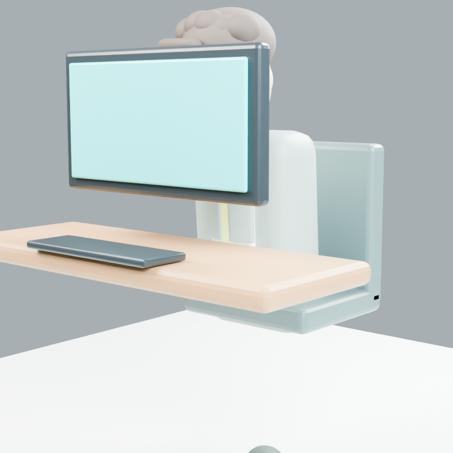

# CrewLab Character Pipeline Audit

**Phase:** 0 — Character Pipeline Audit
**Date:** 2026-08-29
**Branch:** `feature/0026-virtual-3d-office`
**Status:** Complete with a failed A01 quality gate
**Decision:** Stop before B02–E01. Replace the current procedural character source with a licensed production-quality humanoid base or a founder-supplied professional source.

## 1. Scope and authority

This audit covers the active Client Portal route `/office`, the current A01 v10 runtime GLB, its authored workstation, the active React Three Fiber runtime and the residual legacy character/controller code.

The founder's follow-up on 2026-08-29 removes the client/CEO avatar from the requested product. Therefore, every CEO-avatar, walk, proximity, collision and CEO look-at requirement in the supplied production brief is superseded. This aligns with Decision 0018 and Spec 0026 AC-02: the product is an inspectable six-agent workplace, not a player-controlled game.

No tool, package, MCP server, character model or external asset was installed or imported during this phase.

## 2. Sources inspected

- `AGENTS.md`, Spec 0026 and Decision 0018.
- Active `/office` component, Canvas, scene, camera, store and state presentation path.
- Active v8 environment GLB and all six v10 character GLBs.
- Blender source scripts used to generate the v8 environment and v10 characters.
- Current workstation, chair, keyboard and monitor dimensions in the Blender generator.
- Current character and environment unit tests.
- Project package versions, MCP configuration, asset tree, Git status and Git LFS state.
- User-supplied 2026-08-29 runtime screenshot and reproducible offline renders of the exact A01 runtime GLB.

Code discovery used `codebase-memory-mcp` first. Exact file reads and literal searches were used only where the graph was stale, incomplete or unsuitable for generated assets/configuration.

## 3. Current runtime

| Area | Measured version / implementation | Active in garden scene? |
| --- | --- | --- |
| Node.js | `24.16.0` | Development runtime |
| npm | `11.13.0` | Development runtime |
| Next.js | `14.2.35` | Yes |
| React / React DOM | `18.3.1` | Yes |
| Three.js | `0.164.1` | Yes |
| `@react-three/fiber` | `8.17.10` | Yes |
| `@react-three/drei` | `9.117.3` | Yes |
| `@pixiv/three-vrm` | `2.1.2` | Installed, not used by active characters |
| `@react-three/rapier` | `1.5.0` | Installed, not used by active scene |
| Character controller | `ecctrl 1.0.84` | Installed, not used by active scene |
| State | `zustand 4.5.5` | Yes |
| GLB tooling | `gltfjsx 6.5.3` | Development dependency only |
| Post-processing | None | ACES filmic tone mapping is configured directly |
| Blender | Portable Blender `5.2.0 LTS` | Authoring/audit tool |

The active path is:

`/office` → `VirtualOffice` → `OfficeCanvas` → `GardenOfficeScene` → `GardenOfficeModel` → six `RiggedAgentCharacter` instances.

The environment is `/virtual-office/garden-office-v8.glb`. Characters are six separate `/virtual-office/characters/v10/*.glb` files. `useGLTF.preload()` eagerly requests all six character files.

### Renderer and lighting

- Perspective camera: FOV 38, near 0.1, far 90.
- DPR clamped to 1–1.5.
- Antialiasing enabled; `high-performance` power preference.
- ACES filmic tone mapping, sRGB output, exposure 1.1.
- One 2048² shadow-casting directional light, ambient/hemisphere light, three point lights and a 192-resolution lightformer environment.
- Orbit distance 5.8–31 with constrained polar/azimuth angles.
- Focus camera target is the station centre at Y 1.48, but the camera is offset by `[+3.65, +4.65, +5.05]`. This is an agent-station inspection shot, not a facial-quality close-up.

## 4. Current character format and source

**Runtime format:** binary glTF 2.0 (`.glb`) with Draco-compressed geometry.
**Source method:** deterministic procedural Blender generation.
**Rig method:** rigid object hierarchy with named empty pivots; not a deforming humanoid armature.
**Animation method:** React `useFrame()` rotates named pivots procedurally. No embedded clips or crossfades.
**Materials:** 12 flat-color PBR materials per character. No character textures.
**Master/runtime separation:** absent. There is no canonical `A01_MASTER.blend`; the generator script is effectively the source.

The generator constructs the final body from UV spheres, rounded cubes and cylinders. That is directly incompatible with the brief's prohibition on primitive-generated final humans.

## 5. A01 measured asset report

Measured from `portal/public/virtual-office/characters/v10/a01.glb`:

| Metric | A01 v10 |
| --- | ---: |
| File size | 154,376 bytes (150.76 KiB) |
| Nodes | 85 |
| Meshes | 69 |
| Primitives / base draw-call estimate | 69 |
| Vertices across primitives | 11,873 |
| Triangles | 18,228 |
| Materials | 12 |
| Skins / deforming armatures | 0 |
| Named rigid pivots | 16 |
| Morph targets | 0 |
| Animation clips | 0 |
| Textures | 0 |
| Texture resolutions | Not applicable |
| Compression | `KHR_draco_mesh_compression` |

Named pivots are the character root plus pelvis, spine, head, bilateral shoulder/elbow/wrist and bilateral hip/knee/ankle nodes. There are no finger bones, neck/chest hierarchy, foot/toe bones or facial bones.

### Six-character aggregate

| Metric | Six v10 characters |
| --- | ---: |
| Runtime bytes | 902,140 |
| Triangles | 105,868 |
| Mesh primitives | 406 |
| Materials | 72 file-local material definitions |
| Skins | 0 |
| Morph targets | 0 |
| Animation clips | 0 |
| Character textures | 0 |

The character files are compact, but the 406 primitives are the dominant draw-call risk. Low file size here reflects missing production geometry, textures, facial data and clips; it is not evidence of a finished optimized character pipeline.

## 6. Workstation and ergonomics audit

The current Blender generator authors the station in metres:

| Element | Current authored value |
| --- | --- |
| Chair seat centre | Z 0.86 |
| Chair seat half-depth | 0.35 |
| Chair back centre | Y +0.285, Z 1.23, tilted -7° |
| Desk top centre | Z 1.10; 0.14 thickness parameter |
| Keyboard centre | Y -0.62, Z 1.205 |
| Keyboard footprint | 0.62 × 0.23 m |
| Monitor centre | Y -0.34, Z 1.52 |
| Monitor visible width | about 0.82 m per A01 screen before station scaling |
| A01 chair offset | Y +0.61 from station centre |
| A01 runtime character root | local Z +0.61; scene Y anchor 0.41 after Blender-to-Three conversion |

Only `seatOffset`, `rotationY` and `keyboardOffset` are centralized in the web configuration. Required ergonomic anchors such as `PelvisTarget`, hand targets, foot targets, monitor targets and tablet target do not exist. The environment GLB and character GLBs are authored separately, then aligned by three numbers in React.

An invisible cylinder handles pointer selection: radius 1.78 m for A01 and 1.48 m for other agents, height 2.7 m. It is not a physical collider.

## 7. Animation and state audit

`RiggedAgentCharacter` synthesizes motion each frame:

- `idle`: very small root bob, breathing and head drift.
- `working` / `reworking`: alternating elbow and wrist rotations plus a fixed forward spine/head tilt.
- `reviewing` / `waiting_human`: head yaw oscillation.
- `success`: shoulder/elbow gesture and root bob.
- `error` / `rejected`: small spine/head oscillation.

Critical omissions:

- no `AnimationMixer`, authored clips or 0.2–0.5 s crossfades;
- no finger animation or finger rig;
- no blink, eyelids or facial expressions;
- no eye gaze;
- no head/neck target controller;
- no role-specific timing controller;
- no LOD;
- no workstation IK/constraints;
- no deformation or weight-paint system;
- no animation-transition tests.

The state presentation map exists for eight visual states, but the active page is currently initialized from static `INITIAL_OFFICE_AGENTS`. `updateAgentVisualState()` and an A01 mock switch exist in the store; the inspected active `VirtualOffice` contains no 5–10 s backend polling adapter. Spec 0026 AC-04 is therefore not yet proven.

## 8. Visual defect record

| Area | Observation | Gate |
| --- | --- | --- |
| Face | Broad smooth sphere/oval with separate primitive nose and bar mouth; no production facial planes, cheek/jaw topology or mouth loops | FAIL |
| Eyes | Separate whites and irises exist, but no eyelids, eye sockets, pupils with controlled gaze, tear line or blink | FAIL |
| Hair | One cap plus overlapping spheres/rounded blocks; reads as a helmet/blob in silhouette | FAIL |
| Hands | Palm block plus four thin cylinders and a thumb; no credible knuckles, nails, finger rig or deformation | FAIL |
| Body proportions | Readable adult intent, but torso and limbs remain tube/block assemblies with toy-like massing | FAIL |
| Clothing | Color-separated blocks, lapels and tie; no real garment topology, cuffs, seams, folds, normals or fabric texture response | FAIL |
| Neck/shoulders | Rigid parented segments hide joints with overlaps; cannot pass shoulder raise/forward or neck stretch deformation tests | FAIL |
| Hips | Rigid pelvis and leg hierarchy, no skin deformation; hip pinch cannot be tested because there is no deforming mesh | FAIL |
| Sitting pose | Pelvis height approximately matches the cushion, but the torso is too vertical and mechanical; workstation integration is not authored in one master file | FAIL |
| Feet | Shoes exist, but detached/incorrectly parented small parts are visible below the QA floor framing and there are no foot/toe controls | FAIL |
| Desk clipping | Overview distance hides much of the issue; no constraint prevents arms or body from intersecting the desk | FAIL |
| Keyboard clipping | Wrist motion is blind sinusoidal rotation, not target-based; hands are not validated against keys | FAIL |
| Chair clipping | No seat/back collision or cloth/body deformation validation | FAIL |
| Animation stiffness | Alternating joint oscillations read as mechanical whole-arm movement, not a typing phrase with pauses/review | FAIL |
| Facial expression | No morph targets or facial bones; static expression only | FAIL |
| Look-at | None in the active GLB character runtime | FAIL |
| Lighting | Bright neutral scene is improved, but pale untextured skin/clothes wash together and eyes lack controlled catchlight | FAIL |
| Focus camera | Current station focus is too wide/high and can place monitor geometry between camera and face | FAIL |

## 9. Baseline screenshots

### Office overview — user-observed live `/office`

### A01 focus — exact runtime GLB with measured workstation proxies

This view intentionally exposes the current focus problem: the monitor dominates the frame and hides the character.

### A01 face close-up — exact runtime GLB isolated for inspection

### A01 seated front

### A01 seated side

### A01 typing-state pose

The five A01 renders are generated reproducibly by `scripts/blender/render_character_phase0_audit.py` from the exact Portal GLB. They are asset/workstation evidence, not substitutes for final browser QA.

### Browser evidence limitation

The local Portal server returned HTTP 200 and remained available at `http://localhost:3000/office`, but the in-app Browser tool rejected claiming/reloading the localhost tab under its URL policy. No CDP, DevTools or alternate-browser workaround was used. Consequently, fresh browser FPS, JS heap and new browser screenshots are **unknown**, and the browser quality gate remains failed rather than being guessed.

## 10. Performance baseline

### Geometry and draw-call estimate

| Asset set | Bytes | Triangles | Mesh primitives |
| --- | ---: | ---: | ---: |
| Garden office v8 | 15,757,876 | 325,458 | 25 |
| Six v10 characters | 902,140 | 105,868 | 406 |
| Approximate active total | 16,660,016 | 431,326 | 431 base primitives |

Actual WebGL draw calls can exceed the 431 base-primitive estimate because of shadow passes, transparent sorting and renderer decisions. The value is therefore an asset-level estimate, not fabricated renderer telemetry.

### Texture memory

The character GLBs have no textures. The environment embeds 11 unique images used by 12 texture bindings:

- one 1254² PNG;
- nine 1024² PNG/JPEG images;
- one 2048×1024 JPEG.

Decoded RGBA8 storage is approximately 50.0 MiB before mipmaps. A conventional full mip chain would bring that asset-only estimate to about 66.7 MiB. This excludes environment-map render targets, shadow maps, depth buffers and browser overhead. Live GPU memory was not exposed.

### Local HTTP timing

Measured against the running Next.js development server on the same machine:

| Request | Samples | Mean |
| --- | --- | ---: |
| `/office` HTML | 354.17, 88.95, 108.10 ms | 183.74 ms |
| A01 GLB | 37.94, 34.38, 45.04, 32.90, 39.51 ms | 37.95 ms |
| All six GLBs, sequential transfer | 484.78, 209.58, 224.12, 227.78, 227.51 ms | 274.75 ms |

The all-six number is a reproducible sequential local-transfer baseline, not browser parallel-load wall time.

| Runtime metric | Result |
| --- | --- |
| Overview FPS | Unknown — browser policy blocked capture |
| Focus FPS | Unknown — browser policy blocked capture |
| Renderer draw calls | Unknown; asset estimate is 431 base primitives |
| JS heap | Unknown / not exposed |
| GPU load | Unknown / not exposed |
| A01 local file transfer | 37.95 ms mean |
| All-character sequential transfer | 274.75 ms mean |

## 11. Tests and tooling audit

Current tests verify:

- each v10 file is a valid compact GLB between 100–250 KB;
- station seat-to-keyboard facing alignment and diagonal mirroring;
- agent selection opens/closes the detail popup;
- the v8 environment asset budget.

They do **not** verify face quality, skeleton validity, seated contact, hand/keyboard distance, foot/floor distance, clipping, clip transitions, blink, gaze, LOD or browser FPS.

### Skills and MCP

Skills used for this audit: `plan-writing`, `game-art`, `react-three-fiber`, `performance-profiling`, and `browser:control-in-app-browser`.

The repo `.mcp.json` configures read-only Supabase MCP only. `codebase-memory-mcp` is available in the host and was used for code discovery. No Blender MCP is installed or required for Phase 0. The current task does not justify adding one before a source asset and canonical skeleton are selected.

### Git and asset storage

- Git LFS `3.7.1` is installed.
- The repository has no `.gitattributes` LFS policy and `git lfs ls-files` is empty.
- The 150 KB runtime character GLBs do not need LFS.
- A future large `A01_MASTER.blend`, FBX or VRM may justify a narrow LFS rule after its actual size and collaboration needs are known.

## 12. Licensing audit

The active v10 characters are generated by project code and use no imported third-party character mesh or texture. The current runtime therefore has no external character-asset licence dependency, but it also lacks the source quality required by the brief.

MPFB/MakeHuman experiment scripts and local pose experiments exist, but they are not the canonical committed production source and are not accepted as A01. They must not be promoted without a separate source, licence and quality audit.

No unlicensed asset was imported in Phase 0.

## 13. Pipeline decision

### Option C — improve the current procedural model: REJECTED

The current source has no continuous deforming body, facial topology, eyelids, morphs, finger rig, texture system or authored animation library. Reaching the requested commercial quality would require replacing nearly every defining system. Further polishing would preserve the wrong foundation.

### Recommended default — Option B

Use one commercially licensed, high-quality stylized adult humanoid base with:

- clean face and eyelid topology;
- five-finger hands and a retargetable humanoid skeleton;
- editable mesh hair and garments;
- PBR texture sources;
- a licence that explicitly permits commercial derivative use and web runtime distribution.

Customize that source in Blender into `A01_MASTER.blend`, author the real station anchors and clips there, then export optimized GLB runtime assets only after A01 visual approval.

### Conditional preferred route — Option A

If the founder already owns Character Creator 4 / AccuRIG access and licences, use CC4 → AccuRIG → Blender → GLB. No purchase or installation is authorized by this audit.

### Canonical format recommendation

- Master: Blender `.blend` with one canonical humanoid armature.
- Runtime: glTF/GLB with a shared retarget-compatible skeleton, clips and morph targets.
- Do not maintain Rigify, VRM and a custom runtime skeleton simultaneously.
- VRM should be chosen only if the selected licensed source makes VRM expressions/look-at materially simpler; the installed `three-vrm` package alone is not a reason to choose it.

## 14. A01 quality-gate result

| Gate | Result |
| --- | --- |
| Visual quality | FAIL |
| Seated/workstation quality | FAIL |
| Facial/animation quality | FAIL |
| Browser runtime approval | FAIL — fresh browser capture unavailable and current focus composition is inadequate |
| Performance approval | NOT PROVEN — asset budget measured, FPS unavailable |

**Mandatory stop:** do not build or duplicate B02, B03, D01, D02 or E01 from the current v10 source.

## 15. Required next decision and next step

`CHARACTER_BIBLE.md`, the canonical pipeline contract, the asset register and the five project-local production/QA skills now exist. Residual CEO avatar, auto-walk, proximity, collision and look-at runtime code has also been removed. The next strict-order milestone is a single A01 source decision. Before A01 modeling begins, the founder must provide one of:

1. confirmation that an existing CC4/AccuRIG licence and source are available; or
2. authorization to shortlist a commercially licensed stylized humanoid base, with purchase/licence approval handled separately; or
3. a founder-supplied licensed source asset for audit.

Until then, the current six v10 GLBs remain prototype placeholders only.

## 16. Milestone report

**PHASE:** 0 — Character Pipeline Audit
**STATUS:** Complete; A01 failed; production scaling stopped
**WHAT CHANGED:** Added audit evidence and a reproducible A01 audit renderer; no production character asset changed
**VISUAL QUALITY:** Below target; mannequin/primitive quality confirmed
**ASSETS CREATED:** Six baseline PNGs
**ASSETS IMPORTED:** None
**LICENSES:** No new licence
**PACKAGES INSTALLED:** None
**SKILLS USED:** plan-writing, game-art, react-three-fiber, performance-profiling, browser control
**MCP USED:** codebase-memory-mcp; Supabase not needed for the static visual pipeline audit
**TRIANGLES:** A01 18,228; six characters 105,868; active asset total 431,326
**TEXTURE RESOLUTION:** A01 none; environment listed in Section 10
**FILE SIZE:** A01 154,376 B; six characters 902,140 B
**FPS:** Unknown; browser policy blocked capture
**SCREENSHOTS:** `docs/virtual-office/baseline/`
**VIDEOS:** None; no authored clips exist
**KNOWN ISSUES:** All failures in Sections 8 and 14
**NEXT STEP:** Select and license one production-quality A01 source, then build and review A01 only; keep B02–E01 blocked until A01 passes every Character Bible gate
